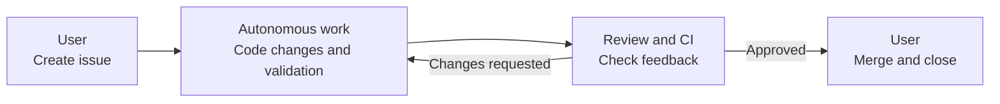

# orbit-pilot

`orbit-pilot` is a Bun CLI that watches GitHub issues assigned to the currently authenticated `gh` user and runs Codex against them.

It automates the "assign to me -> code -> open or update a PR -> respond to review and CI" loop directly from GitHub.

It is intentionally small:

- issue routing is based on assignee only
- repository discovery is based on owners plus an exclude list
- GitHub writes are handled by the Codex agent, while the CLI verifies handoff and decides whether more work is required
- runtime behavior is enforced by built-in rules, while repository-specific guidance can live in `AGENTS.md`

## What It Does

- Polls repositories under configured GitHub owners
- Picks open issues assigned to the current `gh` user
- Re-runs when a linked PR receives review activity, comments, or CI updates
- Keeps one Codex thread per issue and resumes it across runs
- Uses one workspace and one managed branch per issue

## Flow



## Requirements

- `gh` is installed and authenticated
- `gh auth status` succeeds
- Codex SDK authentication is available in the environment
- A trusted environment is available for `danger-full-access` Codex runs

## Permissions

`orbit-pilot` needs enough GitHub access for the Codex agent to read and update issues, pull requests, comments, assignees, and review threads in the repositories you want to use.

## Quick Start

```bash
bun install
cp orbit-pilot.example.toml orbit-pilot.toml
bun run start
```

Run a single polling pass:

```bash
bun run start -- --once
```

## Configuration

`orbit-pilot.toml` is intentionally small.

- `owners`: GitHub users or organizations to scan
- `excludeRepos`: repositories to skip
- `pollIntervalMs`: polling interval
- `workspaceRoot`: local workspace root
- `maxConcurrentRunsPerRepo`: per-repo concurrency
- `codex`: minimal Codex runtime settings

Example:

```toml
pollIntervalMs = 30000
workspaceRoot = "./workspaces"
maxConcurrentRunsPerRepo = 1
owners = ["your-org", "your-user"]
excludeRepos = ["your-org/sandbox"]

[codex]
# model = "gpt-5-codex"
# approvalPolicy = "never"
# modelReasoningEffort = "high"
```

## How It Works

- Only open issues assigned to the current `gh` user are eligible
- An issue stops running when it is closed or unassigned
- The initial run starts when an assigned open issue has no linked open PR
- Continuation runs happen when a linked open PR receives new review, comment, or CI signal
- Linked PR discovery is based on an issue timeline cross reference
- Each issue gets its own managed branch, usually `${issueNo}-orbit-pilot`
- Before review- or CI-triggered re-runs, the latest default branch is merged into the managed branch
- If that merge conflicts, Codex is asked to resolve the conflict in place
- A new thread starts with a runtime-rules acknowledgement turn, then receives the actual issue
- Later turns use short continuation prompts in the same Codex thread
- In other words, `orbit-pilot` does not re-plan a fixed workflow on every turn; it keeps one thread alive and repeatedly says "continue the remaining work" with only the newest tracker context and handoff gaps
- Review-triggered and CI-triggered reruns resume the existing thread instead of starting a new one
- The runner verifies handoff after each turn: clean worktree, pushed branch, and an open PR
- If handoff is incomplete, the runner sends a short continuation prompt describing only the remaining work
- The runner checks the branch PR after each turn and self-assigns it if needed

## Runtime Rules

On the first main-thread Codex turn, `orbit-pilot` injects built-in runtime rules.

Those rules cover behavior that should not be overridden by repositories, such as:

- self-assigning PRs
- resolving only the review threads that were actually fixed
- verifying GitHub writes before claiming success
- completing Git handoff before the task is considered done

Repository-specific guidance can live in `AGENTS.md` at the root of each repository, for example:

- preferred test commands
- coding style or architecture constraints
- repository-specific review expectations

If repository instructions conflict with system or runtime rules, system and runtime rules win.

## State and Recovery

- One workspace is created per issue
- One Codex thread is kept per issue
- State is stored in `.orbit-pilot-state/` next to `orbit-pilot.toml`
- Stored state includes `threadId`, `branchName`, execution status, and previous failure context
